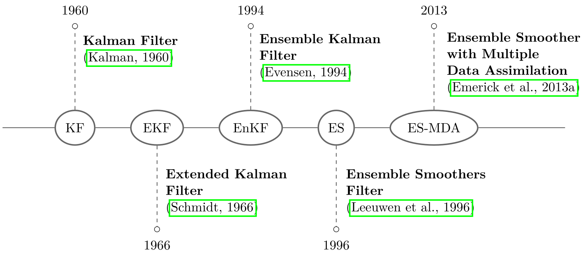
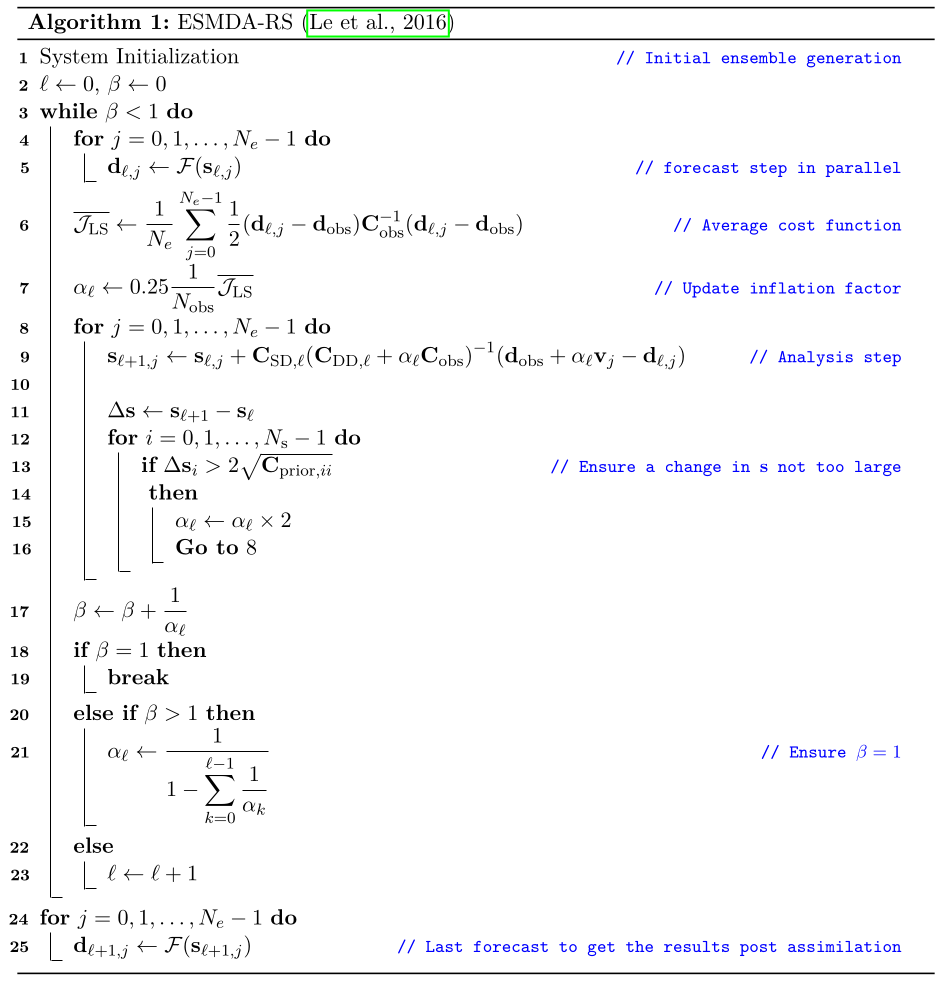
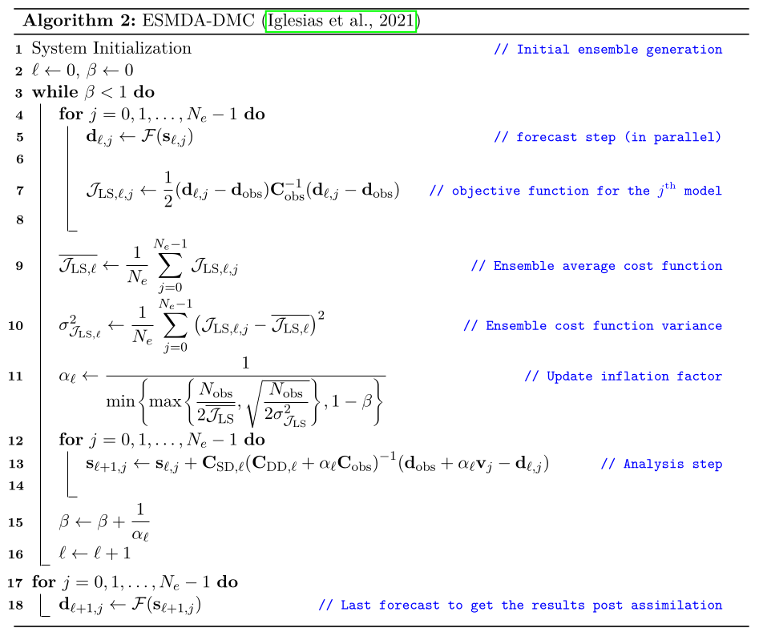

.. _theory_ref:

=================
Theory
=================

What is the Ensemble Smoother with Multiple Data Assimilations (ESMDA) ?

If you are interested in the math behind :py:mod:`pyesmda`, you've comed to the right place. The following is an extract summary coming from the PhD of Antoine COLLET (see chapter 4.4.1, 4.4.3 and 4.4.4 in :cite:t:`colletAssistedHistoryMatching2024`).

General "black-box" framework
^^^^^^^^^^^^^^^^^^^^^^^^^^^^^

Although these three "black-box" or "derivative-free" inversion methods may at first appear to be unrelated, not least because their respective authors present them in this way and do not use the same notations, they are in fact very similar in that they minimize the same objective function and can be derived from the same approximation form of Newton's method: Gauss-Newton iterations. But they differ in the computation of certain matrices and in the implementation.

.. _sec_bayesian_framework:

Bayesian framework
------------------

Considering the measurement equation

.. math::

    \mathbf{d}_{\mathrm{obs}} = \mathcal{F}(\mathbf{s}) + \epsilon, \quad \epsilon \sim \mathcal{N}(\mathbf{0}, \mathbf{C}_{\mathrm{obs}}),

where :math:`\mathcal{F}` designates the forward operator predictions masked in the data domain to match observations, the history matching problem consists in finding :math:`\mathbf{s}` knowing :math:`\mathbf{d}_{\mathrm{obs}}`. This is equivalent to maximizing the probability function :math:`P(\mathbf{s}|\mathbf{d}_{\mathrm{obs}})` to obtain :math:`\widehat{\mathbf{s}}` the maximum likelihood estimate (MLE). Using Bayes theorem, we can calculate the posterior probability density function (PDF) of an event that will occur based on another event that has already occurred with

.. math::

  \begin{aligned}
  \mathrm{Bayes' rule:} \quad P(\mathbf{s}|\mathbf{d}_{\mathrm{obs}}) &= P(\mathbf{s}) \times \dfrac{P(\mathbf{d}_{\mathrm{obs}}|\mathbf{s})}{P(\mathbf{d}_{\mathrm{obs}})},
  \\
  & \propto \underbrace{P(\mathbf{d}_{\mathrm{obs}}|\mathbf{s})}_{\mathrm{likelyhood}} \times \underbrace{P(\mathbf{s})}_{\mathrm{prior}},
  \end{aligned}

where :math:`P(\mathbf{d}_{\mathrm{obs}})` is neglected because it is always positive, it does not depend on :math:`\mathbf{s}` and it is very difficult to compute. Since the measurement errors are assumed to be Gaussian, i.e., :math:`\epsilon \sim \mathcal{N}(\mathbf{0}, \mathbf{C}_{\mathrm{obs}})`, then :math:`P(\mathbf{d}_{\mathrm{obs}}|\mathbf{s})` is Gaussian, and noting that :math:`\mathbb{E}\left[\mathbf{d}_{\mathrm{obs}}|\mathbf{s}\right] = \mathcal{F}(\mathbf{s})` and :math:`\mathrm{cov}(\mathcal{F}(\mathbf{s})) = \mathbf{C}_{\mathrm{obs}}`, it follows that

.. math::

  P(\mathbf{d}_{\mathrm{obs}}|\mathbf{s}) = \dfrac{1}{(2\pi)^{N_{\mathrm{obs}}/2}} \dfrac{1}{\sqrt{\mathrm{det(\mathbf{C}_{\mathrm{obs}})}}} \exp \left( - \dfrac{1}{2}\left(\mathbf{d}_{\mathrm{obs}} - \mathcal{F}(\mathbf{s})\right)^{\mathrm{T}} \mathbf{C}_{\mathrm{obs}}^{-1}\left(\mathbf{d}_{\mathrm{obs}} - \mathcal{F}(\mathbf{s})\right)  \right).

In addition, one always has some prior information about the plausibility of models. In the case of history matching (HM), this includes a geological prior model (hopefully stochastic) constructed from log, core and seismic data, as well as information about the depositional environment. A general assumption is that the updated parameter :math:`\mathbf{s}` is a realization of a random :math:`N_{\mathrm{s}}-\mathrm{dimensional}` vector :math:`\mathbf{S}`, which is (multivariate) Gaussian or multinormal with mean :math:`\mathbf{s}_{\mathrm{prior}}` and autocovariance :math:`\mathbf{C}_{\mathrm{prior}}`. In other words, :math:`\mathbf{S} \sim \mathcal{N}(\mathbf{s}_{\mathrm{prior}}, \mathbf{C}_{\mathrm{prior}})` and the probability density for :math:`\mathbf{S}` is

.. math::

  P(\mathbf{s}) = \dfrac{1}{(2\pi)^{N_{\mathrm{s}}/2}} \dfrac{1}{\sqrt{\mathrm{det(\mathbf{C}_{\mathrm{prior}})}}} \exp \left( - \dfrac{1}{2}\left(\mathbf{s} - \mathbf{s}_{\mathrm{prior}}\right)^{\mathrm{T}} \mathbf{C}_{\mathrm{prior}}^{-1}\left(\mathbf{s} - \mathbf{s}_{\mathrm{prior}}\right)  \right).

Maximizing the product of the prior and the likelihood inserted into Bayes’ theorem yields

.. math::

  P(\mathbf{s}|\mathbf{d}_{\mathrm{obs}}) = a \exp\left( -\mathcal{J} \right),

with

.. math::
  :label: eq_J_MAP

  \begin{aligned}
  a &= \dfrac{1}{(2\pi)^{N_{\mathrm{obs}}/2}} \dfrac{1}{\sqrt{\mathrm{det(\mathbf{C}_{\mathrm{obs}})}}} \times \dfrac{1}{(2\pi)^{N_{\mathrm{s}}/2}} \dfrac{1}{\sqrt{\mathrm{det(\mathbf{C}_{\mathrm{prior}})}}},
  \\
  \mathcal{J}(\mathbf{s}) &=  \underbrace{\frac{1}{2} \left(\mathcal{F}(\mathbf{s}) - \mathbf{d}_{\mathrm{obs}}\right)^{\mathrm{T}} \mathbf{C}_{\mathrm{obs}}^{-1}\left(\mathcal{F}(\mathbf{s}) - \mathbf{d}_{\mathrm{obs}}\right)}_{\mathrm{likelihood~(data misfit)}} \underbrace{+ \frac{1}{2} \left(\mathbf{s} - \mathbf{s}_{\mathrm{prior}}\right)^{\mathrm{T}} \mathbf{C}_{\mathrm{prior}}^{-1}\left(\mathbf{s} - \mathbf{s}_{\mathrm{prior}}\right)}_{\mathrm{prior}},
  \end{aligned}

Maximizing :math:`P(\mathbf{s}|\mathbf{d}_{\mathrm{obs}})`, i.e., finding the MAP estimate (the mode of the posterior distribution), is the same as minimizing its negative logarithm, i.e., the negative log-likelihood :math:`\mathcal{J}`.

.. _gn_procedure:

Gauss-Newton iterations
-----------------------

The MAP or most likely values are obtained by minimizing :math:`\mathcal{J}` from :eq:`eq_J_MAP` with respect to the vector :math:`\mathbf{s}`. As explained earlier, based on the initial guess (or most recent "good solution") :math:`\mathbf{s}_{\ell}`, a Newton-type iterative approach leads to a new solution :math:`\mathbf{s}_{\ell+1}` according to

.. math::

  \mathbf{s}_{\ell+1} = \mathbf{s}_{\ell} - \gamma_{\ell} \left(\dfrac{\partial^{2} \mathcal{J} (\mathbf{s}_{\ell})}{\partial \mathbf{s}_{\ell}^{2}}\right)^{-1} \dfrac{\partial \mathcal{J} (\mathbf{s}_{\ell})}{\partial \mathbf{s}_{\ell}}.

Defining :math:`\mathbf{J}_{\ell}`, the :math:`(N_{\mathrm{obs}} \times N_{\mathrm{s}})` Jacobian matrix of :math:`\mathcal{F}` at :math:`\mathbf{s}_{\ell}` as

.. math::

  \mathbf{J}_{\ell} = \left.\dfrac{\partial \mathcal{F}}{\partial \mathbf{s}} \right|_{\mathbf{s}=\mathbf{s}_{\ell}} = \mathcal{F}(\mathbf{s}_{\ell})\nabla_{\mathrm{s}}^{\mathrm{T}} = \displaystyle \begin{bmatrix}
  \dfrac{\partial \mathcal{F}(\mathbf{s}_{\ell})_{0}}{\partial s_{0}} & \dfrac{\partial \mathcal{F}(\mathbf{s}_{\ell})_{0}}{\partial s_{1}} & \ldots & \dfrac{\partial \mathcal{F}(\mathbf{s}_{\ell})_{0}}{\partial s_{N_{\mathrm{s}}-1}}  \\
  \dfrac{\partial \mathcal{F}(\mathbf{s}_{\ell})_{1}}{\partial s_{0}} & \dfrac{\partial \mathcal{F}(\mathbf{s}_{\ell})_{1}}{\partial s_{1}} & \ldots & \dfrac{\partial \mathcal{F}(\mathbf{s}_{\ell})_{1}}{\partial s_{N_{\mathrm{s}}-1}} \\
  \vdots & \vdots & \ddots & \vdots \\
  \dfrac{\partial \mathcal{F}(\mathbf{s}_{\ell})_{N_{\mathrm{obs}}-1}}{\partial s_{0}} & \dfrac{\partial \mathcal{F}(\mathbf{s}_{\ell})_{N_{\mathrm{obs}}-1}}{\partial s_{1}} & \ldots & \dfrac{\partial \mathcal{F}(\mathbf{s}_{\ell})_{N_{\mathrm{obs}}-1}}{\partial s_{N_{\mathrm{s}}-1}}
  \end{bmatrix},

with the gradient row vector operator :math:`\nabla_{\mathrm{s}}^{\mathrm{T}} = \begin{bmatrix} \dfrac{\partial.}{\partial s_{0}}, &  \ldots & \dfrac{\partial.}{\partial s_{N_{\mathrm{s}} - 1}} \end{bmatrix}` and the column vector :math:`\mathcal{F}(\mathbf{s}_{\ell})`, :math:`\mathcal{F}` is linearized around :math:`\mathbf{s}_{\ell}` with :math:`\mathcal{F}(\mathbf{s}_{\ell+1}) \approx \mathcal{F}(\mathbf{s}_{\ell}) + \mathbf{J}_{\ell}(\mathbf{\mathbf{s}_{\ell+1}} - \mathbf{s}_{\ell})`. Then, the gradient of :math:`\mathcal{J}` reads

.. math::
  :label: eq_grad_J_MAP

  \dfrac{\partial \mathcal{J} (\mathbf{s}_{\ell})}{\partial \mathbf{s}_{\ell}} = \mathbf{J}_{\ell}^{\mathrm{T}} \mathbf{C}_{\mathrm{obs}}^{-1} \left(\mathcal{F}(\mathbf{s}_{\ell})- \mathbf{d}_{\mathrm{obs}}\right) + \mathbf{C}_{\mathrm{prior}}^{-1} \left(\mathbf{s}_{\ell} - \mathbf{s}_{\mathrm{prior}}\right).

The Hessian is approximated in the Gauss-Newton way, i.e., neglecting :math:`\nabla^{2}_{\mathrm{s}} \mathcal{F}(\mathbf{s}_{j})^{\mathrm{T}}`:

.. math::
  :label: eq_hess_J_MAP

  \begin{aligned}
  \dfrac{\partial^{2} \mathcal{J} (\mathbf{s}_{\ell})}{\partial (\mathbf{s}_{\ell})^{2}} & = \mathbf{J}_{\ell}^{\mathrm{T}} \mathbf{C}_{\mathrm{obs}}^{-1} \mathbf{J}_{\ell} + \nabla^{2}_{\mathbf{s}} \mathcal{F}(\mathbf{s}_{\ell})^{\mathrm{T}} \mathbf{C}_{\mathrm{obs}}^{-1} \left(\mathcal{F}(\mathbf{s}_{\ell}) - \mathbf{d}_{\mathrm{obs}}\right) + \mathbf{C}_{\mathrm{prior}}^{-1},
  \\
  & \approx \mathbf{J}_{\ell}^{\mathrm{T}} \mathbf{C}_{\mathrm{obs}}^{-1} \mathbf{J}_{\ell} + \mathbf{C}_{\mathrm{prior}}^{-1}.
  \end{aligned}

A Gauss-Newton iteration is then defined as

.. math::
  :label: eq_gauss_newton_no_lemma

  \begin{aligned}
  \mathbf{s}_{j, \ell+1} & = \mathbf{s}_{\ell} &- \gamma_{\ell} & \left(\dfrac{\partial^{2} \mathcal{J} (\mathbf{s}_{\ell})}{\partial \mathbf{s}_{\ell}^{2}}\right)^{-1} \dfrac{\partial \mathcal{J} (\mathbf{s}_{\ell})}{\partial \mathbf{s}_{\ell}},
  \\
  & = \mathbf{s}_{\ell} &- \gamma_{\ell} & \Bigg(\mathbf{J}_{\ell}^{\mathrm{T}} \mathbf{C}_{\mathrm{obs}}^{-1} \mathbf{J}_{\ell} + \mathbf{C}_{\mathrm{prior}}^{-1}\Bigg)^{-1} \Bigg(\mathbf{J}_{\ell}^{\mathrm{T}} \mathbf{C}_{\mathrm{obs}}^{-1} \left(\mathcal{F}(\mathbf{s}_{\ell}) - \mathbf{d}_{\mathrm{obs}}\right) + \mathbf{C}_{\mathrm{prior}}^{-1} \left(\mathbf{s}_{\ell} - \mathbf{s}_{\mathrm{prior}}\right)\Bigg),
  \\
  & = \mathbf{s}_{\ell} &- \gamma_{\ell} & \Bigg(\mathbf{J}_{\ell}^{\mathrm{T}} \mathbf{C}_{\mathrm{obs}}^{-1} \mathbf{J}_{\ell} + \mathbf{C}_{\mathrm{prior}}^{-1}\Bigg)^{-1} \mathbf{J}_{\ell}^{\mathrm{T}} \mathbf{C}_{\mathrm{obs}}^{-1} \left(\mathcal{F}(\mathbf{s}_{\ell}) -  \mathbf{d}_{\mathrm{obs}}\right),
  \\
  & &- \gamma_{\ell} & \Bigg(\mathbf{J}_{\ell}^{\mathrm{T}} \mathbf{C}_{\mathrm{obs}}^{-1} \mathbf{J}_{\ell} + \mathbf{C}_{\mathrm{prior}}^{-1}\Bigg)^{-1} \mathbf{C}_{\mathrm{prior}}^{-1} \left(\mathbf{s}_{\ell} - \mathbf{s}_{\mathrm{prior}}\right).
  \end{aligned}

Since inverting large covariance matrices is not practical, we use the two following matrix inversion lemmas :cite:p:`golubMatrixComputations1996,petersenMatrixCookbook2008` for the second and third right-hand side terms of :eq:`eq_gauss_newton_no_lemma` respectively

.. math::
  :label: eq_mat_lemmas

  \begin{aligned}
  & \displaystyle \left(\mathbf{A}^{-1}+\mathbf{U}\mathbf{C}^{-1}\mathbf{V}\right)^{-1} \mathbf{U} \mathbf{C}^{-1}=\mathbf{A}\mathbf{U}\left(\mathbf{C}+\mathbf{VAU}\right)^{-1},
  \\
  & \displaystyle \left(\mathbf{A}^{-1}+\mathbf{U}\mathbf{C}^{-1}\mathbf{V}\right)^{-1}=\mathbf{A}-\mathbf{A}\mathbf{U}\left(\mathbf{C}+\mathbf{VAU}\right)^{-1}\mathbf{VA},
  \end{aligned}

with :math:`\mathbf{A} = \mathbf{C}_{\mathrm{prior}}`, :math:`\mathbf{C} = \mathbf{C}_{\mathrm{obs}}`, :math:`\mathbf{U} = \mathbf{J}_{\ell}^{\mathrm{T}}` and :math:`\mathbf{V} = \mathbf{J}_{\ell}`, which gives

.. math::
  :label: eq_gauss_newton_update_base

  \begin{aligned}
  \mathbf{s}_{\ell+1} & = \mathbf{s}_{\ell} - \gamma_{\ell} \Bigg[&&\mathbf{C}_{\mathrm{prior}} \mathbf{J}_{\ell}^{\mathrm{T}} \Bigg(\mathbf{J}_{\ell} \mathbf{C}_{\mathrm{prior}} \mathbf{J}_{\ell}^{\mathrm{T}} + \mathbf{C}_{\mathrm{obs}}\Bigg)^{-1} \Big(\mathcal{F}(\mathbf{s}_{\ell}) -  \mathbf{d}_{\mathrm{obs}}\Big)
  \\
  & && + \mathbf{s}_{\ell} - \mathbf{s}_{\mathrm{prior}} - \mathbf{C}_{\mathrm{prior}} \mathbf{J}_{\ell}^{\mathrm{T}} \Bigg(\mathbf{J}_{\ell} \mathbf{C}_{\mathrm{prior}} \mathbf{J}_{\ell}^{\mathrm{T}} + \mathbf{C}_{\mathrm{obs}}\Bigg)^{-1} \mathbf{J}_{\ell} \Big(\mathbf{s}_{j,l} - \mathbf{s}_{\mathrm{prior}}\Big) \Bigg]
  \\
  & = \mathbf{s}_{\ell} - \gamma_{\ell} \Bigg[ && \mathbf{s}_{\ell} - \mathbf{s}_{\mathrm{prior}} + \mathbf{C}_{\mathrm{prior}} \mathbf{J}_{\ell}^{\mathrm{T}} \Bigg(\mathbf{J}_{\ell} \mathbf{C}_{\mathrm{prior}} \mathbf{J}_{\ell}^{\mathrm{T}} + \mathbf{C}_{\mathrm{obs}}\Bigg)^{-1} \Big(\mathcal{F}(\mathbf{s}_{\ell}) -  \mathbf{d}_{\mathrm{obs}} - \mathbf{J}_{\ell} \Big(\mathbf{s}_{\ell} - \mathbf{s}_{\mathrm{prior}}\Big)\Big) \Bigg].
  \end{aligned}

As previously stated, all implementations described below are derived from this last equation but differ in 1) the way :math:`\mathbf{J}_{\ell}` is approximated, 2) the representation of :math:`\mathbf{C}_{\mathrm{prior}}`, 3) how matrix inversions are performed, and 4) how the step length :math:`\gamma` is chosen.

Uncertainty quantification
--------------------------

Minimizing :math:`\mathcal{J}` allows to find the MAP :math:`\widehat{\mathbf{s}}` i.e., the mean of the PDF but it does not answer the question of how to sample the full PDF (uncertainty quantification). A classic way relies on the linearization of the measurement operator (through the sensitivity matrix :math:`\mathbf{J}`) which, under the assumptions made in :numref:`sec_bayesian_framework`, yields a local Gaussian for the posterior PDF. This local Gaussian is specified by its mean (the MAP) and the posterior covariance matrix :math:`\mathbf{C}_{\mathrm{post}}` which can be approximated by the inverse of the Hessian of the negative log-likelihood of the posterior PDF computed at the MAP estimate :cite:p:`kitanidisQuasiLinearGeostatisticalTheory1995,lepineUncertaintyAnalysisPredictive1999,tarantolaInverseProblemTheory2005`. Considering iteration :math:`\ell` at which :math:`\mathbf{s}_{\ell} = \widehat{\mathbf{s}}`,

.. math::

  \mathbf{C}_{\mathrm{ss}, \ell} \approx \left(\mathbf{H}_{\ell}\right)^{-1} \approx \left(\mathbf{J}_{\ell}^{\mathrm{T}} \mathbf{C}_{\mathrm{obs}}^{-1} \mathbf{J}_{\ell} + \mathbf{C}_{\mathrm{prior}}^{-1}\right)^{-1}.

Using the second lemma in :eq:`eq_mat_lemmas`, it gives

.. math::
  :label: eq_approx_cov_post_gn

  \mathbf{C}_{\mathrm{ss},\ell} \approx \mathbf{C}_{\mathrm{prior}} - \mathbf{C}_{\mathrm{prior}} \mathbf{J}_{\ell}^{\mathrm{T}} \left(\mathbf{C}_{\mathrm{obs}} + \mathbf{J}_{\ell} \mathbf{C}_{\mathrm{prior}} \mathbf{J}_{\ell}^{\mathrm{T}} \right)^{-1} \mathbf{J}_{\ell} \mathbf{C}_{\mathrm{prior}},

and using the forward operator linearization, the posterior covariance matrix on predictions is expressed following :cite:t:`lepineUncertaintyAnalysisPredictive1999`

.. math::
  :label: eq_cdd_analytical

  \mathbf{C}_{\mathrm{dd},\ell} \approx \mathbf{J}_{\ell} \mathbf{C}_{\mathrm{ss},\ell} \mathbf{J}_{\ell}^{\mathbf{T}}.

For large-scale systems, computing and storing the approximation to :math:`\mathbf{C}_{\mathrm{ss}}` is computationally infeasible because the prior covariance matrices arise from finely discretized fields and certain covariance kernels are dense :cite:p:`saibabaFastComputationUncertainty2015`. In addition, computing the dense measurement operator requires solving many forward PDE problems, which can be computationally intractable. Note also that when a quasi-Newton optimization is used such as L-BFGS-B, the BFGS approximation may not converge to the true Hessian matrix :cite:p:`ren-puConvergenceVariableMetric1983`, hence, this approximation can not be used as a posterior covariance matrix. To ovecome these issues, uncertainty analysis and optimization can be conducted using randomized sampling.

.. _sec_rml:

Randomized Maximum Likelihood (RML)
-----------------------------------

Practically, a rigorous sampling procedure of the PDF, e.g., Markov chain Monte Carlo aka MCMC :cite:p:`bonet-cunhaHybridMarkovChain1996,oliverMarkovChainMonte1997` is untractable for large-scale problems and approximate sampling methods must be used :cite:p:`emerickInvestigationSamplingPerformance2013`. The Randomized Maximum Likelihood approach is one of them. It was introduced by both :cite:t:`kitanidisQuasiLinearGeostatisticalTheory1995` and :cite:t:`oliverConditioningPermeabilityFields1996` and consists of sampling both from the prior distribution :math:`\mathbf{s} \sim \mathcal{N}(\mathbf{s}_{\mathrm{prior}},\mathbf{C}_{\mathrm{prior}})` and the measurements distribution :math:`\mathbf{d}_{\mathrm{uc}} \sim \mathcal{N}(\mathbf{d}_{\mathrm{obs}},\mathbf{C}_{\mathrm{obs}})`, forming a set of :math:`N_{e}` couples of "perturbed" parameter and observation vectors {:math:`\mathbf{s}_{j}`, :math:`\mathbf{d}_{\mathrm{uc}, j}`}, also called realizations. The subscript "uc" stands for unconditional because :math:`\mathbf{d}_{\mathrm{uc}_{j}} = \mathbf{d}_{\mathrm{obs}} + \mathbf{v}_{j}`, with :math:`\mathbf{v}_{j}` being an unconditional realization of :math:`\mathbf{C}_{\mathrm{obs}}` with zero mean. Instead of finding a single vector :math:`\widehat{\mathbf{s}}` with :math:`\mathbf{s}_{0} = \mathbf{s}_{\mathrm{prior}}` as an initial guess, RML requires solving :math:`N_{e}` independent minimization problems -- one for each draw which are used as initial guess and measurement vectors -- with the following modified stochastic cost function

.. math::
  :label: eq_J_RML

  \mathcal{J}(\mathbf{s}_{j}) =  \underbrace{\frac{1}{2} \left(\mathcal{F}(\mathbf{s}_{j}) - \mathbf{d}_{\mathrm{uc},j}\right)^{\mathrm{T}} \mathbf{C}_{\mathrm{obs}}^{-1}\left(\mathcal{F}(\mathbf{s}_{j}) - \mathbf{d}_{\mathrm{uc}, j}\right)}_{\mathrm{likelihood (data misfit)}} \underbrace{+ \frac{1}{2} \left(\mathbf{s}_{j} - \mathbf{s}_{\mathrm{prior}}\right)^{\mathrm{T}} \mathbf{C}_{\mathrm{prior}}^{-1}\left(\mathbf{s}_{j} - \mathbf{s}_{\mathrm{prior}}\right)}_{\mathrm{prior}},

where :math:`j` denotes the :math:`j^{\mathrm{th}}` draw. After optimizing the :math:`N_{e}` problems, one obtains two ensembles of posterior parameter and prediction vectors that can be written under matrix form as

.. math::

  \begin{aligned}
  \mathbf{S} &= \begin{pmatrix}\mathbf{s}_{0}, & \mathbf{s}_{1}, & \dots, & \mathbf{s}_{N_{e}-1}\end{pmatrix},
  \\
  \mathbf{D} &= \begin{pmatrix}\mathbf{d}_{0}, & \mathbf{d}_{1}, & \dots, & \mathbf{d}_{N_{e}-1}\end{pmatrix},
  \end{aligned}

with shape (:math:`N_{\mathrm{s}} \times N_{e}`) and (:math:`N_{\mathrm{obs}} \times N_{e}`) respectively. Given two samples consisting of :math:`N_{e}` independent realizations :math:`\mathbf{x}_{0}, ..., \mathbf{x}_{N_{e}-1}` and :math:`\mathbf{y}_{0}, \dots, \mathbf{y}_{N_{e}-1}` of :math:`N_{x}` and :math:`N_{y}-\mathrm{dimensional}` vectors :math:`\mathbf{X} \in \mathbb{R}^{N_{x}\times 1}` and :math:`\mathbf{Y} \in \mathbb{R}^{N_{y}\times 1}`, an unbiased estimator of the covariance matrix

.. math::

  \mathrm{cov}(\mathbf{X},\mathbf{Y}) = \mathbb{E}\left[\left(\mathbf{X}-\mathbb{E}[\mathbf{X}]\right)\left(\mathbf{Y}-\mathbb{E}[\mathbf{Y}]\right)^{\mathrm{T}}\right],

is the empirical (or sample) covariance matrix denoted by a :math:`\sim`

.. math::
  :label: eq_empirical_cross_covariance

  \widetilde{\mathbf{C}} = \frac{1}{N_{e} - 1} \sum_{j=0}^{N_{e}-1}\left(\mathbf{x}_{j} - \overline{\mathbf{x}}\right)\left(\mathbf{x}_{j} - \overline{\mathbf{x}} \right)^{\mathrm{T}}.

The empirical auto-covariance matrices for :math:`\mathbf{s}` and :math:`\mathbf{d}` can then be computed from the ensembles :math:`\mathbf{S}` and :math:`\mathbf{D}` as

.. math::
  :label: eq_empirical_cross_covariances

  \begin{aligned}
  \widetilde{\mathbf{C}}_{\mathrm{SS}} & = \frac{1}{N_{e} - 1} \sum_{j=0}^{N_{e}-1}\left(\mathbf{s}_{j} - \overline{\mathbf{s}}\right)\left(\mathbf{s}_{j} - \overline{\mathbf{s}} \right)^{\mathrm{T}}  = \mathbf{A}_\mathrm{s}\mathbf{A}_\mathrm{s}^{\mathrm{T}},
  \\
  \widetilde{\mathbf{C}}^{f}_{\mathrm{DD}} &= \frac{1}{N_{e} - 1} \sum_{j=0}^{N_{e}-1}\left(\mathbf{d}_{j} -\overline{\mathbf{d}} \right)\left(\mathbf{d}_{j} - \overline{\mathbf{d}} \right)^{\mathrm{T}} = \mathbf{A}_\mathrm{d}\mathbf{A}_\mathrm{d}^{\mathrm{T}},
  \\
  \end{aligned}

with :math:`\mathbf{A}_\mathrm{s}` and :math:`\mathbf{A}_\mathrm{d}` the centered anomaly matrices with size (:math:`N_{\mathrm{s}} \times N_{e}`) and (:math:`N_{\mathrm{obs}} \times N_{e}`) defined as

.. math::
  :label: eq_anomaly_matrices

  \begin{aligned}
  \mathbf{A}_{\mathrm{s}} &= \dfrac{1}{\sqrt{N_{e}-1}}\mathbf{S} \left(\mathbf{I}_{N_{e}} - \dfrac{1}{N_{e}} \mathbf{11}^{\mathrm{T}} \right),
  \\
  \mathbf{A}_{\mathrm{d}} &= \dfrac{1}{\sqrt{N_{e}-1}}\mathbf{D} \left(\mathbf{I}_{N_{e}} - \dfrac{1}{N_{e}} \mathbf{11}^{\mathrm{T}} \right).
  \end{aligned}

where :math:`\mathbf{1} \in \mathbb{R}^{N_e}` is defined as a column vector with all elements equal to 1, i.e., :math:`\mathbf{11}^{\mathrm{T}}` is a (:math:`N_e \times N_e`) matrix filled with one, :math:`\mathbf{I}_{N_e}` is the :math:`N_e\mathrm{-dimensional}` identity matrix, and the projection  :math:`\left(\mathbf{I}_{N_{e}} - \dfrac{1}{N_{e}} \mathbf{1}^{\mathrm{T}} \right)` subtracts the mean from the ensemble :cite:p:`evensenEfficientImplementationIterative2019`. Assuming that :math:`\overline{\mathbf{d}} = \mathcal{F}(\overline{\mathbf{s}})`, a first-order Taylor series expansion gives

.. math::
  :label: eq_1st_order_taylor_cov

  \mathbf{d}_{j} - \overline{\mathbf{d}} = \mathcal{F}\left(\mathbf{s}_{j}\right) - \mathcal{F}(\overline{\mathbf{s}}) = \mathbf{J} \left(\mathbf{s}_{j} - \overline{\mathbf{s}}\right).

Injecting the previous results in the auto-covariance definitions :eq:`eq_empirical_cross_covariances` yields

.. math::

  \begin{aligned}
  \widetilde{\mathbf{C}}_{\mathrm{DD}} &= \frac{1}{N_{e} - 1} \sum_{j=0}^{N_{e}-1}\left(\mathbf{d}_{j} -\overline{\mathbf{d}} \right)\left(\mathbf{d}_{j} - \overline{\mathbf{d}} \right)^{\mathrm{T}},
  \\
  & = \frac{1}{N_{e} - 1} \sum_{j=0}^{N_{e}-1} \mathbf{J} \left(\mathbf{s}_{j} - \overline{\mathbf{s}}\right) \left(\mathbf{s}_{j} - \overline{\mathbf{s}}\right)^{\mathrm{T}} \mathbf{J}^{\mathrm{T}} = \mathbf{J} \widetilde{\mathbf{C}}_{\mathrm{SS}} \mathbf{J}^{\mathrm{T}},
  \end{aligned}

which is consistent with the analytical expression of :math:`\mathbf{C}_{\mathrm{dd}}` given in :eq:`eq_cdd_analytical`. When used with Gauss-Newton or quasi-Newton optimization coupled to an adjoint state model, the method has been shown to provide correct sampling of the PDF, giving as good a data fit as that generated by MCMC, even for highly nonlinear models :cite:p:`emerickInvestigationSamplingPerformance2013`. However, the cost of the method is very high because each optimization problem is solved independently. We will see further that the ensemble-based methods used in this manuscript, ESMDA and SIES, rely on the same idea of randomized sampling but also use the ensemble to compute the sensitivity matrices, thereby avoiding the need for an adjoint state and drastically reducing the number of runs required, while maintaining a correct PDF sampling.

Ensemble smoothers (ES)
^^^^^^^^^^^^^^^^^^^^^^^

From the Kalman filters to ensemble smoothers
---------------------------------------------

.. _fig_main_kalman_filters_evolutions:

   Main Kalman filters evolutions

The Ensemble Smoother is a parameter estimation and data assimilation technique belonging to the family of Kalman filters (:numref:`fig_main_kalman_filters_evolutions`). Kalman filters were first introduced in a linear form by :cite:t:`kalmanNewApproachLinear1960` and have been successively improved. The first improvement was made to handle non-linear systems and resulted in the so-called Extended Kalman Filters, EKF :cite:p:`schmidtApplicationStateSpaceMethods1966`. The main limitation of EKF was the cost of explicitly computing and storing the covariance matrix (:math:`N_{y} \times N_{y}`), where :math:`N_{y} = N_{\mathrm{s}} + N_{u}` the size of the parameter-state vector. The cost of linearization is also important, making the Kalman filter unsuitable for applications to high-dimensional systems (typically, applications in geosciences). For this reason, a Monte Carlo implementation, namely the Ensemble Kalman Filter (EnKF) was introduced by :cite:t:`evensenSequentialDataAssimilation1994`. In this case, the covariance matrix is not computed directly but approximated from an ensemble of realizations (\og physical \fg states of the system), which is much cheaper. This is why these filters are still widely used in meteorological, petroleum and hydrogeological applications among others :cite:p:`oliverRecentProgressReservoir2011`. Following the notation and introduction used by :cite:t:`emerickEnsembleSmootherMultiple2013`, in the EnKF, :math:`\mathbf{y}^{n}` denotes the sub parameter-state vector for the :math:`n^{\mathrm{th}}` data assimilation time step (simulation time step for which there is at least one observation to assimilate). It is defined as

.. math::

  \mathbf{y}^{n} = \begin{bmatrix}  \mathbf{s}^{n} \\ \mathbf{u}^{n} \end{bmatrix},

where :math:`\mathbf{s}^{n}` and :math:`\mathbf{u}^{n}` are the :math:`N_{\mathrm{s}}` and :math:`N_{u}-\mathrm{dimensional}` vectors of model parameters and state of the dynamical system at iteration :math:`n` respectively. In vectorial form, the analysis (update) equation can be written as

.. math::
  :label: eq_analysis_enkf

  \mathbf{y}^{n, a}_{j} = \mathbf{y}^{n, f}_{j} + \widetilde{\mathbf{C}}_{\mathrm{YD}}^{n,f} \left(\widetilde{\mathbf{C}}_{\mathrm{DD}}^{n,f} + \mathbf{C}_{\mathrm{obs}}^{n} \right)^{-1} \left(\mathbf{d}_{\mathrm{uc}, j}^{n} - \mathbf{d}_{j}^{n,f}\right),

where :math:`j` denotes the index of the member (realization) among the ensemble which is of size :math:`N_{e}`. The superscript :math:`a` stands for \og analyzed \fg or \og assimilated \fg while :math:`f` denotes the \og forecasted \fg state before the correction (assimilation). Practically, this means that when observations are available and an assimilation is performed at time index :math:`n`, :math:`\mathbf{y}^{n, a}_{j}` becomes the new system state and it is used instead of :math:`\mathbf{y}^{n, f}_{j}` to predict :math:`\mathbf{y}^{n+1, f}_{j}`. Thus, :math:`\widetilde{\mathbf{C}}_{\mathrm{YD}}^{n,f}` is the :math:`N_{y} \times N_{d}^{n}` empirical cross-covariance matrix between the forecast state vector and predicted data vector; :math:`\widetilde{\mathbf{C}}_{\mathrm{DD}}^{n,f}` is the :math:`N_{d}^{n} \times N_{d}^{n}` empirical auto-covariance matrix of predicted data :math:`\mathbf{d}^{n,f}`; :math:`\mathbf{C}_{\mathrm{obs}}^{n}` is the :math:`N_{d}^{n} \times N_{d}^{n}` covariance matrix of observed data measurement errors; :math:`N_{d}^{n}` is the number of data points (observations) assimilated at the :math:`n^{\mathrm{th}}` time index; :math:`\mathbf{d}_{\mathrm{uc},j}^{n,f}` is the vector of \og perturbed \fg observations for time index :math:`n`, i.e., :math:`\mathbf{d}_{\mathrm{uc},j}^{n,f} \sim \mathcal{N}\left(\mathbf{d}_{\mathrm{obs}}^{n},\mathbf{C}_{\mathrm{obs}}^{n}\right)`; and :math:`\mathbf{d}^{n,f}` is the corresponding :math:`N_{d}^{n}-\mathrm{dimensional}` vector of predicted data.

This type of filter is particularly interesting for systems which present chaotic and unstable dynamics such as oceanic and atmospheric models :cite:p:`evensenDataAssimilationEnsemble2007` or water quality models :cite:p:`wangWhichFilterData2023`. However, EnKF also presents some drawbacks :cite:p:`evensenDataAssimilationEnsemble2007,reynoldsAssistedHistoryMatching2017`:

- The computation of empirical cross-covariance matrices :math:`\mathbf{C}_{\mathrm{YD}}^{n,f}` and :math:`\mathbf{C}_{\mathrm{DD}}^{n,f}` is performed a great number of times (at each new set of observations);
- The size of :math:`\mathbf{C}_{\mathrm{YD}}^{n,f}` varies linearly with :math:`N_{\mathrm{u}}` and :math:`N_{\mathrm{s}}` and can be problematic for large-scale system;
- Sequential data assimilation with EnKF requires to updating both model parameters and primary variables (parameter-state-estimation problem) which translates to modifications of the forward model (consequently an access to the code is required), with the ability to stop and restart (checkpointing);
- It does not necessarily produce a correct initial state as it may needs a few time iterations to reach a model in accordance with the observations. This is satisfactory for real time assimilation, but not suited to invert a field to its initial value, e.g., an uraninite field being dissolved in ISR RTM;
- In practice, we may observe inconsistency between the updated parameters and states.

To solve these issues, the ensemble smoother (ES) formulation was introduced targeting primarily reservoir simulation history matching :cite:p:`leeuwenDataAssimilationInverse1996`. Going from EnKF to ES, the main assumptions were that 1) reservoir simulation models are typically stable functions of the rock property fields; 2) model uncertainties could be neglected. Hence, when applying ES, the state-parameter estimation problem is downgraded to a simpler parameter-only estimation problem. In this case, all observations are assimilated at once and the analysis equation becomes

.. math::
  :label: eq_analysis_es

  \mathbf{s}^{a}_{j} = \mathbf{s}^{f}_{j} + \widetilde{\mathbf{C}}_{\mathrm{SD}}^{f} \left(\widetilde{\mathbf{C}}_{\mathrm{DD}}^{f} + \mathbf{C}_{\mathrm{obs}} \right)^{-1} \left(\mathbf{d}_{\mathrm{uc},j} - \mathbf{d}_{j}^{f}\right).

Compared to :eq:`eq_analysis_enkf`, empirical covariance matrices must be computed only once. :math:`\widetilde{\mathbf{C}}_{\mathrm{SD}}^{f}` is the empirical cross-covariance matrix between the prior vector of model parameters, :math:`\mathbf{s}^{f}`, and the vector of predicted data, :math:`\mathbf{d}^{f}`, with size :math:`N_{\mathrm{s}} \times N_{\mathrm{obs}}`; :math:`\widetilde{\mathbf{C}}_{\mathrm{DD}}^{f}` is the :math:`N_{\mathrm{obs}} \times N_{\mathrm{obs}}` auto-covariance matrix of predicted data and :math:`\mathbf{C}_{\mathrm{obs}}` is the covariance matrix of (all) observed data measurement errors with the same :math:`N_{\mathrm{obs}} \times N_{\mathrm{obs}}` size. The empirical cross-covariance matrices are computed according to :eq:`eq_empirical_cross_covariance`, i.e., in the EnKF way :cite:p:`evensenDataAssimilationEnsemble2007,aanonsenEnsembleKalmanFilter2009` as

.. math::
  :label: eq_es_cov_prior

  \begin{aligned}
  \widetilde{\mathbf{C}}^{f}_{\mathrm{SD}} & = \frac{1}{N_{e} - 1} \sum_{j=0}^{N_{e}-1}\left(\mathbf{s}^{f}_{j} - \overline{\mathbf{s}^{f}_{j}}\right)\left(\mathbf{d}^{f}_{j} - \overline{\mathbf{d}^{f}} \right)^{\mathrm{T}},
  \\
  \widetilde{\mathbf{C}}^{f}_{\mathrm{DD}} &= \frac{1}{N_{e} - 1} \sum_{j=0}^{N_{e}-1}\left(\mathbf{d}^{f}_{j} -\overline{\mathbf{d}^{f}_{j}} \right)\left(\mathbf{d}^{f}_{j} - \overline{\mathbf{d}^{f}} \right)^{\mathrm{T}},
  \\
  \widetilde{\mathbf{C}}^{f}_{\mathrm{SS}} &= \frac{1}{N_{e} - 1} \sum_{j=0}^{N_{e}-1}\left(\mathbf{s}^{f}_{j} - \overline{\mathbf{s}^{f}_{j}}\right)\left(\mathbf{s}^{f}_{j} - \overline{\mathbf{s}^{f}_{j}}\right)^{\mathrm{T}} \approx \mathbf{C}_{\mathrm{prior}}.
  \end{aligned}
  `

In this form, there is no inconsistency between states and parameters. ES is also efficient because like PCGA, it avoids an explicit computation and inversion of large covariance matrices (:math:`\mathbf{C}_{\mathrm{prior}}`). It is also easy to implement with any simulator as it becomes a real black-box (this is
not the case with EnKF) and it offers substantial reduction in computational cost compared to EnKF :cite:p:`skjervheimEnsembleSmootherAssisted2011` with a complete parallelization for equivalent results. In addition the \emph{a posteriori} uncertainty in both parameters and predictions can be characterized using the assimilated ensemble

.. math::
  :label: eq_es_cov_posterior

  \begin{aligned}
  \widetilde{\mathbf{C}}^{a}_{\mathrm{DD}} &= \frac{1}{N_{e} - 1} \sum_{j=0}^{N_{e}-1}\left(\mathbf{d}^{a}_{j} -\overline{\mathbf{d}^{a}_{j}} \right)\left(\mathbf{d}^{a}_{j} - \overline{\mathbf{d}^{a}} \right)^{\mathrm{T}},
  \\
  \widetilde{\mathbf{C}}^{a}_{\mathrm{SS}} &= \frac{1}{N_{e} - 1} \sum_{j=0}^{N_{e}-1}\left(\mathbf{s}^{a}_{j} - \overline{\mathbf{s}^{a}_{j}}\right)\left(\mathbf{s}^{a}_{j} - \overline{\mathbf{s}^{a}_{j}}\right)^{\mathrm{T}}.
  \end{aligned}

Interestingly, although it might seem different at first, ES has been proven to be an approximation to RML-Gauss-Newton equation with full step where all ensemble members are updated with the same average sensitivity matrix :cite:p:`reynoldsIterativeFormsEnsemble2006`.

.. _sec_equivalence_es_rml_gn:

Equivalence between ES and RML-Gauss-Newton
-------------------------------------------

Considering an ensemble of :math:`N_{e}` realizations, recalling the objective function in :eq:`eq_J_MAP` and the associated update given in :eq:`eq_gauss_newton_update_base`, a Gauss-Newton iteration for the :math:`j^{\mathrm{th}}` ensemble member reads

.. math::

  \mathbf{s}_{\ell+1,j} = \mathbf{s}_{\ell,j} - \gamma_{\ell,j} \Bigg[ \mathbf{s}_{\ell,j} - \mathbf{s}_{\mathrm{prior}} + \mathbf{C}_{\mathrm{prior}} \mathbf{J}_{\ell,j}^{\mathrm{T}} \Bigg(\mathbf{J}_{\ell,j} \mathbf{C}_{\mathrm{prior}} \mathbf{J}_{\ell,j}^{\mathrm{T}} + \mathbf{C}_{\mathrm{obs}}\Bigg)^{-1} \Big(\mathcal{F}(\mathbf{s}_{\ell,j}) -  \mathbf{d}_{\mathrm{uc},j} - \mathbf{J}_{\ell,j} \Big(\mathbf{s}_{\ell,j} - \mathbf{s}_{\mathrm{prior}}\Big)\Big) \Bigg].

Evaluating :math:`\mathbf{J}_{\ell, j}` for each realization and at the local iterate requires the existence of the tangent linear operator of the non-linear forward model :math:`\mathcal{F}`, i.e., an adjoint state model, which is generally not available and still requires :math:`N_{\mathrm{obs}}` forward runs at each local iterate and for each Gauss-Newton iteration. Therefore, we perform a linearization of the model around the ensemble mean and use the same gradient for all realizations through the average sensitivity matrix :math:`\overline{\mathbf{J}} \equiv \left( \nabla \mathcal{F} |_{\mathbf{s} = \overline{\mathbf{s}}} \right)^{\mathrm{T}} \in \mathcal{R}^{N_{\mathrm{s}}\times N_{\mathrm{obs}}}`. A common step length :math:`\gamma` is also used, and the update now reads

.. math::
  :label: eq_45684

  \mathbf{s}_{\ell+1,j} = \mathbf{s}_{\ell,j} - \gamma_{\ell} \Bigg[\mathbf{s}_{\ell,j} - \mathbf{s}_{\mathrm{prior}} + \mathbf{C}_{\mathrm{prior}} \overline{\mathbf{J}}_{\ell}^{\mathrm{T}} \Bigg(\overline{\mathbf{J}}_{\ell} \mathbf{C}_{\mathrm{prior}} \overline{\mathbf{J}}_{\ell}^{\mathrm{T}} + \mathbf{C}_{\mathrm{obs}}\Bigg)^{-1} \Big(\mathcal{F}(\mathbf{s}_{\ell,j}) -  \mathbf{d}_{\mathrm{uc},j} - \overline{\mathbf{J}}_{\ell} \Big(\mathbf{s}_{\ell,j} - \mathbf{s}_{\mathrm{prior}}\Big)\Big) \Bigg].

Following :cite:t:`reynoldsIterativeFormsEnsemble2006`, we derive the ensemble smoother as an approximation to RML-Gauss-Newton equation with full step (:math:`\gamma=1`), performing a single iteration with :math:`\ell = 0` (initial guess) and using :math:`\mathbf{s}_{\mathrm{prior}} = \mathbf{s}_{0,j}`. As a consequence, :math:`\mathbf{s}_{0,j} - \mathbf{s}_{\mathrm{prior}} = 0`. Denoting :math:`\mathbf{s}_{1, j} = \mathbf{s}_{j}^{a}`, :math:`\mathbf{s}_{0, j} = \mathbf{s}_{j}^{f}` and :math:`\mathcal{F}(\mathbf{s}_{0, j}) = \mathbf{d}^{f}_{j}` then :eq:`eq_45684` becomes

.. math::
  :label: eq_454658754

  \mathbf{s}_{j}^{a} = \mathbf{s}_{j}^{f} - \Bigg[\mathbf{C}_{\mathrm{prior}} \overline{\mathbf{J}}_{0}^{\mathrm{T}} \Bigg(\overline{\mathbf{J}}_{0} \mathbf{C}_{\mathrm{prior}} \overline{\mathbf{J}}_{0}^{\mathrm{T}} + \mathbf{C}_{\mathrm{obs}}\Bigg)^{-1} \Big(\mathbf{d}_{j}^{f} -  \mathbf{d}_{\mathrm{uc},j} \Big) \Bigg].

Assuming that :math:`\overline{\mathbf{d}^{f}} = \mathcal{F}(\overline{\mathbf{s}}^{f})`, recall :eq:`eq_1st_order_taylor_cov` from the previous section

.. math::

  \mathbf{d}_{j}^{f} - \overline{\mathbf{d}^{f}} = \mathcal{F}\left(\mathbf{s}_{j}^{f}\right) - \mathcal{F}(\overline{\mathbf{s}}^{f}) = \mathbf{J}|_{\overline{\mathbf{s}}^{f}}\left(\mathbf{s}_{j}^{f} - \overline{\mathbf{s}}^{f}\right) \equiv \overline{\mathbf{J}}_{0}\left(\mathbf{s}_{j}^{f} - \overline{\mathbf{s}}^{f}\right).

Injecting the previous results in the auto-covariances definitions yields

.. math::
  :label: eq_es_covmd_gs

  \begin{aligned}
  \widetilde{\mathbf{C}}^{f}_{\mathrm{SD}} & = \frac{1}{N_{e} - 1} \sum_{j=0}^{N_{e}-1}\left(\mathbf{s}^{f}_{j} - \overline{\mathbf{s}^{f}_{j}}\right)\left(\mathbf{d}^{f}_{j} - \overline{\mathbf{d}^{f}} \right)^{\mathrm{T}},
  \\
  &= \frac{1}{N_{e} - 1} \sum_{j=0}^{N_{e}-1}\left(\mathbf{s}^{f}_{j} - \overline{\mathbf{s}^{f}_{j}}\right)\left(\mathbf{s}_{j}^{f} - \overline{\mathbf{s}}^{f}\right)^{\mathrm{T}}\overline{\mathbf{J}}_{0}^{\mathrm{T}} = \mathbf{C}_{\mathrm{prior}} \overline{\mathbf{J}}_{0}^{\mathrm{T}},
  \end{aligned}

.. math::
  :label: eq_es_covdd_gs

  \begin{aligned}
  \widetilde{\mathbf{C}}^{f}_{\mathrm{DD}} &= \frac{1}{N_{e} - 1} \sum_{j=0}^{N_{e}-1}\left(\mathbf{d}^{f}_{j} -\overline{\mathbf{d}^{f}_{j}} \right)\left(\mathbf{d}^{f}_{j} - \overline{\mathbf{d}^{f}} \right)^{\mathrm{T}},
  \\
  & = \frac{1}{N_{e} - 1} \sum_{j=0}^{N_{e}-1} \overline{\mathbf{J}}_{0} \left(\mathbf{s}_{j}^{f} - \overline{\mathbf{s}}^{f}\right) \left(\mathbf{s}_{j}^{f} - \overline{\mathbf{s}}^{f}\right)^{\mathrm{T}}\overline{\mathbf{J}}_{0}^{\mathrm{T}} = \overline{\mathbf{J}}_{0} \mathbf{C}_{\mathrm{prior}} \overline{\mathbf{J}}_{0}^{\mathrm{T}}.
  \end{aligned}

Using :eq:`eq_es_covmd_gs` and :eq:`eq_es_covdd_gs` in :eq:`eq_454658754` gives the following equation which is the ensemble smoother

.. math::

  \begin{aligned}
  \mathbf{s}_{j}^{a} & = \mathbf{s}_{j}^{f} - \widetilde{\mathbf{C}}^{f}_{\mathrm{SD}} \Bigg(\widetilde{\mathbf{C}}^{f}_{\mathrm{DD}} + \mathbf{C}_{\mathrm{obs}}\Bigg)^{-1} \Big(\mathbf{d}_{j}^{f} -  \mathbf{d}_{\mathrm{uc},j} \Big),
  \\
  & = \mathbf{s}_{j}^{f} + \widetilde{\mathbf{C}}^{f}_{\mathrm{SD}} \Bigg(\widetilde{\mathbf{C}}^{f}_{\mathrm{DD}} + \mathbf{C}_{\mathrm{obs}}\Bigg)^{-1} \Big(\mathbf{d}_{\mathrm{uc},j} - \mathbf{d}_{j}^{f} \Big).
  \end{aligned}

As shown by :cite:t:`reynoldsIterativeFormsEnsemble2006`, ES (and EnKF) are indeed the same as updating each ensemble member by doing one iteration of the Gauss-Newton method and using the same average sensitivity matrix for all ensemble members. This partially explains the reasonable performance of EnKF when applied to history matching production data.

.. _sec_inflation:

Ensemble size, inflation and need for localization
--------------------------------------------------

In reservoir history matching, the computational cost of ES and of other derived iterative ensemble smoothers mainly depends on the ensemble size since the most expensive part is usually the computation of the prediction ensemble :math:`\mathbf{D}` which requires :math:`N_{e}` simulations at each assimilation. Consequently, the number of ensemble realizations is a trade-off between performance and accuracy. In the literature, the \og magic \fg range 30-100 is usual, and although several methods have been proposed :cite:p:`yinOptimalEnsembleSize2015,leutbecherEnsembleSizeHow2019,milinskiHowLargeDoes2020`, the choice seems to be application dependent and empirical.
When the size of the ensemble chosen for inversion is too small, it might not be statistically representative of the variability of the unknowns: the low rank approximation of the error covariance matrix introduces sampling errors which decrease proportionally to :math:`1/\sqrt{N_{e}}` :cite:p:`evensenEnsembleKalmanFilter2003`. For small :math:`N_{e}`, long-range spurious correlations might appear causing the smoother divergence and collapse. Covariance localization and inflation are two techniques developed to overcome these issues :cite:p:`evensenLocalizationInflation2022`.

As detailed by :cite:t:`evensenLocalizationInflation2022`, there are several ways to perform localization. In this work, we choose to follow the localization in observation space following the approximate localization scheme introduced by :cite:t:`houtekamerSequentialEnsembleKalman2001`. :eq:`eq_analysis_es` writes

.. math::
  :label: eq_analysis_es_loc

  \mathbf{s}^{a}_{j} = \mathbf{s}^{f}_{j} + \boldsymbol{\rho}_{\mathrm{SD}} \odot \widetilde{\mathbf{C}}_{\mathrm{SD}}^{f} \left(\boldsymbol{\rho}_{\mathrm{DD}} \odot \widetilde{\mathbf{C}}_{\mathrm{DD}}^{f} + \mathbf{C}_{\mathrm{obs}} \right)^{-1} \left(\mathbf{d}_{\mathrm{uc},j} - \mathbf{d}_{j}^{f}\right),

where :math:`\boldsymbol{\rho}_{\mathrm{SD}}` is a damping (correlation) matrix with size (:math:`N_{\mathrm{s}} \times N_{\mathrm{obs}}`); :math:`\boldsymbol{\rho}_{\mathrm{DD}}` is a damping matrix with size (:math:`N_{\mathrm{obs}} \times N_{\mathrm{obs}}`); and :math:`\odot` is the Schur (or Hadamard) product performing element-wise multiplication of two matrices. These correlation matrices are typically built based on spatial and time distances from measurement and rely on damping functions such as proposed by :cite:t:`gaspariConstructionCorrelationFunctions1999`.
#+LATEX: Some have been implemented in :py:mod:`pyesmda` and a descriptive notebook is available\footnote{https://pyesmda.readthedocs.io/en/stable/tutorials/correlation\_matrices\_building.html}. For large-scale applications, these matrices are probably sparse and sparse representation can be used to save memory and computation time.

As stated by :cite:t:`evensenEfficientImplementationIterative2019` in reservoir models, as well as in ISR RTM, a consistent localization is difficult because there are both long-range correlations and transient phenomena in the reservoir, e.g., purely spatial localization can normally not be used. An alternative approach to distance-based localization is to perform adaptive localization based empirical correlations :cite:p:`andersonExploringNeedLocalization2007,bishopFlowadaptiveModerationSpurious2007,fertigAssimilatingNonlocalObservations2007`. The correlation is defined as

.. math::

  \mathrm{cor}(\mathbf{X},\mathbf{Y}) = \dfrac{\mathrm{cov}(\mathbf{X},\mathbf{Y})}{\sigma_{\mathbf{X}} \sigma_{\mathbf{Y}}}.

Using :eq:`eq_empirical_cross_covariance`, the empirical correlation matrix is defined as

.. math::
  :label: eq_empirical_cross_correlation

  \begin{split}
  \widetilde{\boldsymbol{\rho}}_{\mathrm{DD}} &= \dfrac{\mathbf{A}_{\mathrm{d}}\mathbf{A}_{\mathrm{d}}^{\mathrm{T}}}{\mathbf{A}_{\mathrm{d}}\mathbf{A}_{\mathrm{d}}},
  \\
  \widetilde{\boldsymbol{\rho}}_{\mathrm{SD}} &= \dfrac{\mathbf{A}_{\mathrm{s}}\mathbf{A}_{\mathrm{d}}^{\mathrm{T}}}{\mathbf{A}_{\mathrm{s}}\mathbf{A}_{\mathrm{d}}},
  \end{split}

with the centered anomaly matrices :math:`\mathbf{A}_\mathrm{s}` and :math:`\mathbf{A}_\mathrm{d}` defined in :eq:`eq_anomaly_matrices`. The initial idea was to perform a thresholding of the correlation matrices. Such approach imples that a model variable is updated by only using observations that have large enough correlations (in magnitudes) with it, regardless of the physical locations of these observations. More recently, the proposed approach by :cite:t:`luoCorrelationBasedAdaptiveLocalization2018,luoAutomaticAdaptiveLocalization2020,luoContinuousHyperparameterOPtimization2022` that combines truncation-based adaptive localization with tapering of each local update seems promising to overcome the small discontinuities in the updates noticed by :cite:t:`evensenSpuriousCorrelationsLocalization2009`.

Comments on the ensemble smoothers
----------------------------------

Remembering :eq:`eq_analysis_es`, the ES analysis equation can be written as

.. math::

  \begin{split}
  \mathbf{s}^{a}_{j} &= \mathbf{s}^{f}_{j} + \mathbf{A}_{\mathrm{s}}^{f} (\mathbf{A}_{\mathrm{s}}^{f})^{\mathrm{T}} \left(\widetilde{\mathbf{C}}_{\mathrm{DD}}^{f} + \mathbf{C}_{\mathrm{obs}} \right)^{-1} \left(\mathbf{d}_{\mathrm{uc},j} - \mathbf{d}_{j}^{f}\right),
  \\
  & = \mathbf{s}^{f}_{j} + \mathbf{A}_{\mathrm{S}}^{f} \mathbf{M}^{f}.
  \end{split}

As stated by :cite:t:`reynoldsAssistedHistoryMatching2017`, since :math:`\mathbf{A}_{\mathrm{S}}^{f}` is a linear combination of the initial ensemble of models, it indicates that every :math:`\mathbf{s}^{a}_{j}` is a linear combination of the models in the initial ensemble, i.e., we are trying to find a linear combination of the initial ensemble members that matches data. Thus, if the models contain large structural features, it will be difficult to capture the geology by assimilating data with the ES.

.. _sec_esmda:

Ensemble Smoother with Multiple Data Assimilation (ESMDA)
^^^^^^^^^^^^^^^^^^^^^^^^^^^^^^^^^^^^^^^^^^^^^^^^^^^^^^^^^

With ES, all data are assimilated simultaneously, which means that a single Gauss-Newton correction is applied to condition the ensemble to all available data. Therefore, ES may not be able to provide acceptable data matches when applied to reservoir history-matching problems (several Gauss-Newton iterations are usually required). Moreover, in ES, there is a possibility of ensemble collapse (convergence to a local minimum) particularly when measurement errors :math:`\mathbf{C}_{\mathrm{obs}}` are low. To overcome both of these problems, :cite:t:`emerickHistoryMatchingTimelapse2012,emerickEnsembleSmootherMultiple2013` proposed to assimilate the same data multiple times with an inflated measurement error covariance (:math:`\mathbf{C}_{\mathrm{obs}}`). The covariance inflation was inspired by the fact that for history-matching with gradient-based methods, some form of damping at early iterations is usually necessary to avoid getting trapped in an excessively rough model which does not give a very good history match :cite:p:`liHistoryMatchingThreePhase2003,gaoImprovedImplementationLBFGS2006`.

Thanks to its simple formulation, ESMDA is perhaps the most used iterative form of the ensemble smoother in geoscience applications. In ESMDA, the ES analysis equation from :eq:`eq_analysis_es` becomes

.. math::
  :label: eq_esmda_update

  \mathbf{s}_{\ell+1, j} = \mathbf{s}_{\ell,j} + \mathbf{C}_{\mathrm{SD}, \ell}\left(\mathbf{C}_{\mathrm{DD},\ell}+\alpha_{\ell}
  \mathbf{C}_{\mathrm{obs}}\right)^{-1} \left(\mathbf{d}_{\mathrm{obs}} + \alpha_{\ell} \mathbf{v}_{j} - \mathcal{F}(\mathbf{s}_{\ell,j}) \right),

with :math:`\mathbf{v}_{j}` an unconditional realization of :math:`\mathcal{N}(\mathbf{0},\mathbf{C}_{\mathrm{obs}})`, and :math:`\alpha_{\ell}` the inflation factors which should respect the following constraint

.. math::
  :label: eq_esmda_alpha

  \sum_{\ell=0}^{N_{a}-1} \frac{1}{\alpha_{\ell}} = 1.

with :math:`N_{a}` the number of assimilations and :math:`\ell` the assimilation index. This condition is imposed because it makes single (ES) and multiple data assimilations (ESMDA) equivalent for the linear-Gaussian case :cite:p:`emerickEnsembleSmootherMultiple2013`.

Localization
------------

As far as localization is concerned, it can be applied in the same way than for the ES as described in :numref:`sec_inflation`. The analysis step reads

.. math::
  :label: eq_esmda_update_localized

  \mathbf{s}_{\ell+1, j} = \mathbf{s}_{\ell,j} + \boldsymbol{\rho}_{\mathrm{SD}} \odot \mathbf{C}_{\mathrm{SD}, \ell}\left(\boldsymbol{\rho}_{\mathrm{DD}} \odot \mathbf{C}_{\mathrm{DD},\ell}+\alpha_{\ell}
  \mathbf{C}_{\mathrm{obs}}\right)^{-1} \left(\mathbf{d}_{\mathrm{obs}} + \alpha_{\ell} \mathbf{v}_{j} - \mathcal{F}(\mathbf{s}_{\ell,j}) \right).

.. _sec_auto_param_tunning_esmda:

Automatic hyperparameters tuning
--------------------------------

In addition to the number of realizations in the initial ensemble, the original form of ESMDA requires the definition of two hyperparameters, namely the number of assimilations :math:`N_{a}`, and the sequence of inflation factors :math:`\{\alpha_{0}, \alpha_{1}, \dots,\alpha_{N_{a}-1}\}`. Unfortunately, this form of ESMDA lacks the ability to continue “iterating” if the data mismatch is too large, and the optimal associated inflation factors could only be determined by trial and error. It becomes intractable for large-scale problems and tends to make the results dependent on the practitioner. It is also worth noting that the choice of the inflation factor sequence is critical, as it can both prevent near ensemble collapse and limit extreme values of rock property fields for complex problems. To avoid a purely empirical user-based choice, several adaptive procedures have been proposed in the literature. Two of them have been implemented in :py:mod:`pyesmda` and tested thoroughly in this work, namely the Restricted Step (ESMDA-RS) procedure established by :cite:t:`leAdaptiveEnsembleSmoother2016`, and the Data Misfit Controller (ESMDA-DMC) procedure developed by :cite:t:`iglesiasAdaptiveRegularisationEnsemble2021`. Pseudo-codes for these two procedures are given in :numref:`alg_esmda_rs`, :numref:`alg_esmda_dmc` respectively. Interestingly, both procedures result in strong initial inflation factors, that decrease over the course of iterations. This is consistent with the earlier idea from :cite:t:`liHistoryMatchingThreePhase2003,gaoImprovedImplementationLBFGS2006` that some form of stronger damping is required at early iterations.

Regarding the number of realizations in the initial ensemble, :cite:t:`ranazziEnsembleSizeInvestigation2019` investigated its impact on the number of iterations required with the restricted step automatic procedure. They found that the ensemble size influenced the reduction of the uncertainty of the posterior models, but it did not show any influence on the total number of assimilations and on the choice of the inflation factor (they used 100, 200, 300, 400 and 500 ensemble members).

.. _alg_esmda_rs:

   ESMDA-RS

.. _alg_esmda_dmc:

   ESMDA-DMC

.. _sec_esmda_analysis_step:

Efficient analysis step
-----------------------

The main computational difficulty in the ESMDA algorithm is the inversion of the term :math:`\mathbf{C}_{\ell} = \mathbf{C}_{\mathrm{DD}, \ell}+\alpha_{\ell}
\mathbf{C}_{\mathrm{obs}}` (line 9 of :numref:`alg_esmda_rs` and line 13 of :numref:`alg_esmda_dmc`). Inspired by the implementation from `Equinor <https://github.com/equinor/iterative\_ensemble\_smoother/tree/main>`_, seven approaches have been implemented in :py:mod:`pyesmda` and are summarized in the :numref:`table_esmda_inversion`.

The four first methods are exact but not efficient and not suited for large-scale inversion with big data sets. The last three methods are approximate or exact depending on :math:`N_e`, :math:`N_{\mathrm{obs}}`, and the truncation factor which gives the fraction of the highest singular values to keep (in the interval ]0, 1]):

 - if :math:`N_{e} \leq N_{\mathrm{obs}}`, then the solution is always approximated, regardless of the truncation;
 - if :math:`N_{e} > N_{\mathrm{obs}}`, then the solution is exact when truncation is 1.0.

Only the three first methods are compatible with the localization by :math:`\boldsymbol{\rho}_{\mathrm{DD}}` because the others rely on :math:`\mathbf{A}_{\mathrm{d}} \mathbf{A}_{\mathrm{d}}^{\mathrm{T}}` and the Shur product is not distributive in front of the matrix multiplication.

.. _table_esmda_inversion:

.. table:: Inversion approaches for the term
   :math:`\mathbf{C}_{\ell} = \mathbf{C}_{\mathrm{DD}, \ell} + \alpha_{\ell} \mathbf{C}_{\mathrm{obs}}`

  +---------------------+---------------------------------------------------------------------------+-----------+--------------------------------------------------------------+
  | Method              | Description                                                               | LSC? [1]  | Reference                                                    |
  +=====================+===========================================================================+===========+==============================================================+
  | Naive               | Naive inversion of :math:`\mathbf{C}_{\ell}`                              | NO        | -                                                            |
  +---------------------+---------------------------------------------------------------------------+-----------+--------------------------------------------------------------+
  | Exact - Cholesky    | Solve :math:`\mathbf{C}_{\ell} \mathbf{x} = \mathbf{b}` with a Cholesky   | NO        | -                                                            |
  |                     | factorization [2] of :math:`\mathbf{C}_{\ell}`                            |           |                                                              |
  +---------------------+---------------------------------------------------------------------------+-----------+--------------------------------------------------------------+
  | Exact - Lstsq       | Solve :math:`\mathbf{C}_{\ell} \mathbf{x} = \mathbf{b}` with least squares| NO        | -                                                            |
  +---------------------+---------------------------------------------------------------------------+-----------+--------------------------------------------------------------+
  | Exact - Woodbury    | Use the second Woodbury lemma in :eq:`eq_mat_lemmas`                      | NO        | -                                                            |
  +---------------------+---------------------------------------------------------------------------+-----------+--------------------------------------------------------------+
  | Rescaled            | TSVD [3] of :math:`\mathbf{C}_{\ell}` with a rescaling procedure to       | YES       | Appendix A.1 from Emerick (2012)                             |
  |                     | compensate for truncation of small singular values                        |           |                                                              |
  +---------------------+---------------------------------------------------------------------------+-----------+--------------------------------------------------------------+
  | Subspace            | TSVD [3] of :math:`\mathbf{A}_{\mathrm{d},\ell}` instead of               | YES       | Appendix A.2 from Emerick (2012)                             |
  |                     | :math:`\mathbf{C}_{\ell}`, more efficient when                            |           |                                                              |
  |                     | :math:`N_e \ll N_{\mathrm{obs}}`                                          |           |                                                              |
  +---------------------+---------------------------------------------------------------------------+-----------+--------------------------------------------------------------+
  | Subspace rescaled   | Same as subspace but with a rescaling procedure                           | YES       | Appendix A.2 from Emerick (2012)                             |
  +---------------------+---------------------------------------------------------------------------+-----------+--------------------------------------------------------------+

.. rubric:: Notes

[1] Large Scale Compatible?

[2] Because :math:`\mathbf{C}_{\mathrm{DD}, \ell}` is real symmetric positive semi-definite,
:math:`\mathbf{C}_{\ell}` is positive definite if :math:`\mathbf{C}_{\mathrm{obs}}` is positive definite.

[3] TSVD = Truncated Singular Value Decomposition
